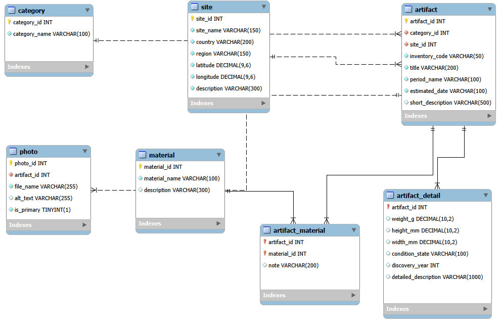

# 3. E-R model

E-R model znázorňuje základní strukturu databáze projektu Archaeo-LLM. V diagramu jsou zachyceny hlavní entity databáze, jejich atributy a vzájemné vztahy.

Centrální tabulkou je tabulka `artifact`, která reprezentuje archeologický nález. Na ni navazují tabulky `category`, `site`, `photo`, `material`, `artifact_material` a `artifact_detail`.

Tabulka `category` slouží k zařazení nálezu do kategorie. Tabulka `site` uchovává informace o lokalitě nálezu. Tabulka `photo` eviduje obrazovou dokumentaci. Tabulka `material` obsahuje seznam materiálů a vazební tabulka `artifact_material` řeší vztah M:N mezi nálezy a materiály. Tabulka `artifact_detail` doplňuje hlavní záznam o měřitelné a popisné údaje.

