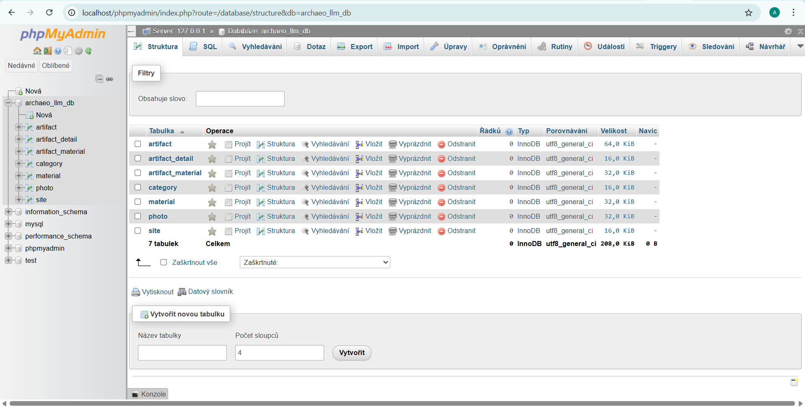
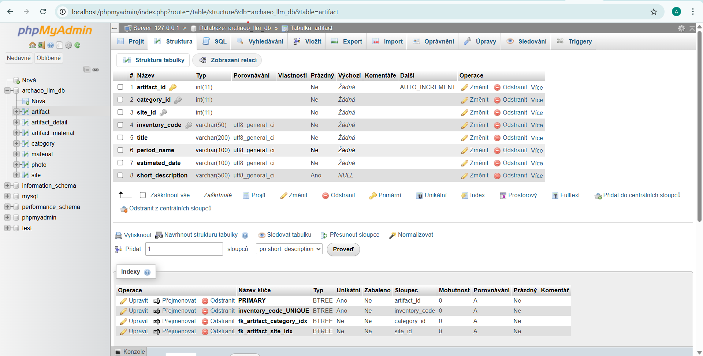
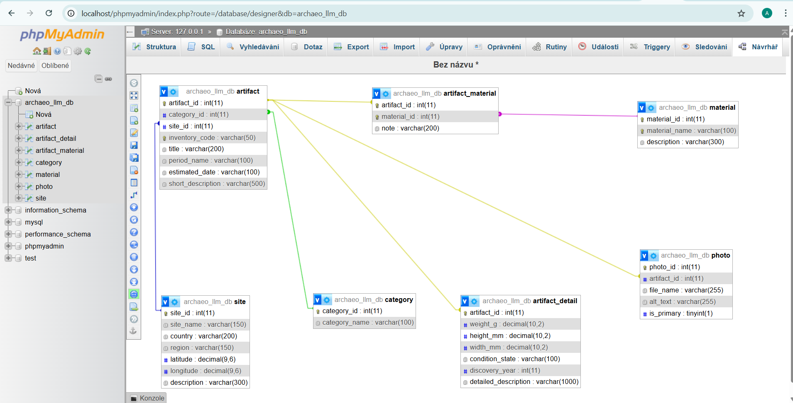

# 8. Ukázka databáze v praxi

V předchozích kapitolách byla databáze Archaeo-LLM popsána pomocí slovního zadání, E-R modelu, lineárního zápisu, relačního modelu, normalizace a ukázkových dat. Nyní je potřeba ukázat, jak se taková databáze projeví v praxi po vytvoření v databázovém systému.

Relační databáze není běžný dokument podobný tabulce v Excelu. Databázový systém, například MySQL nebo MariaDB, běží jako služba na pozadí počítače nebo serveru. Data jsou uložena ve strukturovaných tabulkách a pracuje se s nimi pomocí jazyka SQL.

Protože přímé psaní SQL příkazů není pro začátečníka vždy pohodlné, používají se také grafické nástroje pro správu databází. Jedním z nejznámějších nástrojů je phpMyAdmin, který běží ve webovém prohlížeči a umožňuje prohlížet databáze, tabulky, strukturu sloupců a vztahy mezi tabulkami.

## Zobrazení databáze v phpMyAdmin

Po importu SQL skriptu byla v lokálním prostředí vytvořena databáze `archaeo_llm_db`. V phpMyAdmin je možné zobrazit seznam všech tabulek, které databáze obsahuje.

V našem případě databáze obsahuje sedm tabulek:

- `artifact`,
- `artifact_detail`,
- `artifact_material`,
- `category`,
- `material`,
- `photo`,
- `site`.

Tyto tabulky odpovídají návrhu popsanému v předchozích kapitolách práce.

Na tomto zobrazení je vidět, že databáze není tvořena jednou společnou tabulkou. Údaje jsou rozděleny podle významu. Samostatně jsou evidovány archeologické nálezy, kategorie, lokality, fotografie, materiály, vazby mezi nálezy a materiály a detailní údaje o nálezech.

## Struktura hlavní tabulky artifact

Hlavní tabulkou databáze je `artifact`. Tato tabulka představuje konkrétní archeologický nález. V phpMyAdmin lze otevřít její strukturu a zkontrolovat jednotlivé sloupce, datové typy a klíče.

Ve struktuře tabulky `artifact` jsou vidět základní atributy nálezu:

- `artifact_id` jako primární klíč,
- `category_id` jako odkaz na kategorii,
- `site_id` jako odkaz na lokalitu,
- `inventory_code` jako inventární nebo pracovní kód,
- `title` jako název nálezu,
- `period_name` jako historické období,
- `estimated_date` jako odhadované datování,
- `short_description` jako stručný popis.

Tato tabulka tedy neukládá všechny informace o nálezu najednou. Obsahuje základní evidenční údaje a pomocí cizích klíčů se odkazuje na další tabulky. Díky tomu není nutné opisovat například název lokality nebo název kategorie přímo do každého záznamu nálezu.

## Zobrazení relačních vazeb

phpMyAdmin umožňuje zobrazit také návrh vztahů mezi tabulkami. V tomto zobrazení je vidět, že tabulka `artifact` stojí uprostřed databázového modelu a ostatní tabulky ji doplňují.

Vazby v modelu odpovídají návrhu:

- `category` je propojena s `artifact`, protože každý nález patří do určité kategorie,
- `site` je propojena s `artifact`, protože každý nález je přiřazen k určité lokalitě,
- `photo` je propojena s `artifact`, protože jeden nález může mít více fotografií,
- `artifact_detail` rozšiřuje hlavní záznam nálezu o detailní údaje,
- `artifact_material` propojuje nálezy s materiály,
- `material` obsahuje samostatný seznam materiálů.

Nejdůležitější je zde vazební tabulka `artifact_material`. Ta řeší vztah M:N mezi archeologickými nálezy a materiály. Bez této tabulky by bylo nutné ukládat více materiálů do jednoho textového pole, což by porušovalo správnou relační logiku.

## Význam phpMyAdmin pro práci s databází

phpMyAdmin v této práci slouží jako praktická kontrola toho, že databázový návrh lze převést z modelu do skutečného databázového prostředí. Umožňuje ověřit, že tabulky existují, že mají správné sloupce a že mezi nimi vznikly relační vazby.

Z pohledu studenta je výhoda phpMyAdminu v tom, že není nutné všechny informace kontrolovat pouze přes příkazový řádek. Struktura databáze je viditelná graficky a lze ji snadno procházet v prohlížeči.

## Shrnutí praktické ukázky

Ukázka v phpMyAdmin potvrzuje, že návrh databáze Archaeo-LLM byl převeden do praktické podoby. Databáze `archaeo_llm_db` obsahuje sedm tabulek, které odpovídají návrhu v E-R modelu, lineárním zápisu i relačním modelu dat.

Hlavní tabulkou je `artifact`, která uchovává základní údaje o archeologických nálezech. Ostatní tabulky ji doplňují o kategorie, lokality, fotografie, materiály a detailní údaje. Tím je prakticky doloženo, že databázový návrh není pouze teoretický, ale je možné jej vytvořit a zobrazit v reálném databázovém nástroji.
